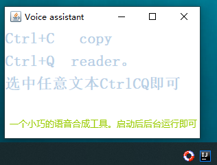

# CtrlCQ


### 前言
> 此项目进支持允许在Windows环境下。

本项目依赖于jintellitype项目，请先阅读项目 data/doc目录下的jintellitype使用教程.md


### 项目介绍

世界之大，无奇不有。大家好，这里是大火趣分享，
“CtrlCQ”是怎么回事呢？“Ctrl+C”相信大家都很熟悉，但是“CtrlCQ”又是怎么回事呢，
下面就让小编带大家一起了解一下吧。
CtrlCQ呢就是Ctrl+C和Ctrl+Q的组合 其实也就是 windows电脑上常用的两组按键了。
大家可能会很惊讶说 Ctrl+Q怎么会经常使用呢？
虽然大家平常经常使用Ctrl+C和Ctrl+V，。但是用了此软件后，相信不久得将来大家会习惯使用Ctrl+C和Ctrl+Q的。
因为使用Ctrl+C和Ctrl+Q你就会听到美妙的小姐姐的朗读声。不信你选择本段本文使用一下Ctrl+C和Ctrl+Q试试。
好了这就是关于 CtrlCQ  的所有介绍了。大家有什么想法呢，欢迎在评论区告诉小编一起讨论哦！

为啥这样说话？UC给钱了。（开个玩笑。~_~）


### 运行

在项目的bin目录下，已经存在打包好的jar包了。可以直接双击打开。如有需要可自行修改代码，重新编译。




### 构建可执行文件

data/bin目录下已经有了可运行的jar包
如果对源码进行了修改可以重新在控制台运行`mvn clean package`打包项目，  
并打包新的包替换掉CtrlCQ-jar-with-dependencies.jar即可


### 目录结构
```
ctrlcq
├── frame                      -- 窗口类
├── listenter                  -- 监听器
├── tts                        -- tts
├── url                        -- 工具类
└── App                        -- 多文件实现的启动类
└── Reader                     -- 单文件实现的启动类
```

### 技术选型


| 技术         | 说明                | 官网                                                         |
| ------------ | -------------------| ------------------------------------------------------------ |
| Java awt     | Java原生GUI         | [https://docs.oracle.com/javase/tutorial/uiswing/start/index.html](https://docs.oracle.com/javase/tutorial/uiswing/start/index.html) |
| HttpClient   | HTTP请求框架        | [https://mvnrepository.com/artifact/org.apache.httpcomponents/httpclient](https://mvnrepository.com/artifact/org.apache.httpcomponents/httpclient)         |
| jintellitype | 系统按键监听器框架   | [https://mvnrepository.com/artifact/com.melloware/jintellitype](https://mvnrepository.com/artifact/com.melloware/jintellitype) |
| jlayer       | MP3播放工具         | [https://mvnrepository.com/artifact/javazoom/jlayer](https://mvnrepository.com/artifact/javazoom/jlayer)         |
| hutool       | 工具类              | [https://www.hutool.cn/](https://www.hutool.cn/) |


### 开发工具

工具 | 说明 | 官网
----|----|----
IDEA | 开发IDE | https://www.jetbrains.com/idea/download


工具 | 版本号 | 下载
----|----|----
JDK | 1.8 | https://www.oracle.com/technetwork/java/javase/downloads/jdk8-downloads-2133151.html


### 注意事项

如需设置开机自启动，请将jar包放入此目录

> C:\ProgramData\Microsoft\Windows\Start Menu\Programs\StartUp

此项目短小精悍。核心代码不到200行。极为简单。快来看一看吧。


### 做一个爱思考的人
做任何一个小demo其实都可能蕴藏着无限的衍生和扩展。
看似这个小demo也就这么回事了，主要就是一个语音合成，播放就完了

如果你有稍作思考，这仅仅只是开始。在这过程中我们还可以认为的做很多事

 - 如：在语音合成的地方，我们可以对剪切板的本文进行分析。在语音合成前把需要合成的文本做一些修改
```
input = "搞笑泥浆去尿"
input.replace("搞笑泥浆去尿","funny mud go pee")//一些文字进行替换
tts(input);//再进行语音合成
```

 - 如: 语音合成地方换成一些 讯飞，百度提供的SDK 可以进行倍速朗读。
 - 如：根据此思路，可以联想一下，微信读书的实现思路，他们更复杂，可能涉及到图像识别，语音合成等。而且还要买书的版权-_-;
但是如果自己有思路了，是不是可以自己实现一个微信读书软件，那样就不用付费了。
 - 如：按CtrlQ时，如果剪切板不是文本，而是一张图片呢？是否可以进行OCR操作，将图片转换成文本，再进行语音合成？
 
 如果你有好的想法欢迎扩展.


### 相关链接

[Github](https://github.com/dahuoyzs/CtrlCQ)

[Gitee](https://gitee.com/dahuoyzs/CtrlCQ)


### 作者信息


```json
{
	"github": "https://github.com/dahuoyzs",
	"email": "dahuoyzs@gmail.com",
	"QQ": "835476090"
}
```

2020年5月