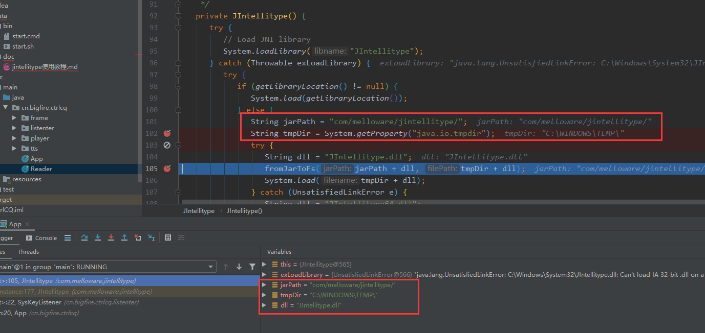

# Java设置全局热键——第三方包jintellitype实现

Java原生API并不支持为应用程序设置全局热键。要实现全局热键，需要用JNI方式实现，这就涉及到编写C/C++代码，  
这对于大多数不熟悉C/C++的javaer来说，有点困难。不过幸好，国外有人已经实现了，发布成第三方java包，  
借此，我们可以很方便的设置全局热键而不用编写任何C/C++代码。

jintellitype官网貌似目前访问不到，  
这里提供下载：[http://pan.baidu.com/s/1kTIDxgN](https://pan.baidu.com/s/1kTIDxgN)

##  官方Readme
JIntellitype
http://www.melloware.com/
1. 概述
   --------
JIntellitype是一个用于与Microsoft Intellitype键盘交互的API
命令以及在应用程序中注册全局热键。
这个API是一个Java JNI库，它使用一个DLL来完成所有通信
与Windows。这个库只适用于Windows。
你曾经想过让CTRL+SHIFT+G最大化你的Swing应用程序吗
在桌面上，即使应用程序没有焦点?现在你可以
注册一个Windows热键组合，您的应用程序将收到警报
当您选择的组合按下窗口中的任何位置时。
2. 特点
   --------
   -> 是否可以在Windows中注册全局热键组合
   -> 应用程序即使没有焦点也会得到通知。
   -> 可以对那些播放，暂停，停止，下一步，转发媒体键像Winamp
   -> 非常少的代码，易于使用的API
   -> JIntellitypeTester.java中包含的示例

3. 安装
   ------------

   为用户:
   -> 将以下文件复制到类路径中
        -> jintellitype.jar
        -> JIntellitype.dll (or put in Windows/System32)
		-> JIntellitype64.dll (rename to JIntellitype.dll and put in path)

   为开发人员:
   -> 要进行构建，需要从Apache安装Maven 2.0.7或更高版本。只运行“mvn package”从
      用于构建项目的pom.xml所在的目录。

   -> 要构建c++代码，您需要使用c++ IDE。加载包含的.dev项目时，不要这样做
忘记编辑Project->选项并在“目录”选项卡下更改要包含的包含目录
	  both:
	      /java5/include
		  /java5/include/win32

      其中“java5”是Java JDK的位置。


4. 快速使用
   ------------

// 创建 JIntellitype
	...
        JIntellitype.getInstance().addHotKeyListener(new HotKeyListener() {...);
        JIntellitype.getInstance().addIntellitypeListener(new IntellitypeListener() {...);
	...

// 分配全局热键到Windows+A和ALT+SHIFT+B
        JIntellitype.getInstance().registerHotKey(1, JIntellitype.MOD_WIN, (int)'A');
        JIntellitype.getInstance().registerHotKey(2, JIntellitype.MOD_ALT + JIntellitype.MOD_SHIFT, (int)'B');

// 监听热键
        public void onHotKey(int aIdentifier) {
           if (aIdentifier == 1)
             System.out.println("WINDOWS+A hotkey pressed");
           }
        }

// 监听智能播放/暂停命令
        public void onIntellitype(int aCommand) {
           switch (aCommand) {
		case JIntellitype.APPCOMMAND_MEDIA_PLAY_PAUSE:
			System.out.println("Play/Pause message received " + Integer.toString(aCommand));
			break;
		default:
			System.out.println("Undefined INTELLITYPE message caught " + Integer.toString(aCommand));
			break;
		}
        }

// 结束
	...
	JIntellitype.getInstance().cleanUp();
	System.exit(0);


有关更多信息，请参见test/com/melloware/jintellitype/JIntellitypeTester.java中的演示。

## 个人总结快速搭建

在项目中添加依赖1.3.9版本
```xml
        <dependency>
            <groupId>com.melloware</groupId>
            <artifactId>jintellitype</artifactId>
            <version>1.3.9</version>
        </dependency>
```

把dll复制到这几个位置
```shell
#系统System32目录
C:\Windows\System32
#可能有所差异 可以 System.out.println(System.getProperty("java.io.tmpdir")); 来查看
C:\Windows\TEMP
#就是项目中的resources目录下添加com/melloware/jintellitype/这个目录
项目/src/main/resources/com/melloware/jintellitype/
```

## 问题说明

```shell
Exception in thread "main" com.melloware.jintellitype.JIntellitypeException: Could not load JIntellitype.dll from local file system or from inside JAR
	at com.melloware.jintellitype.JIntellitype.<init>(JIntellitype.java:114)
	at com.melloware.jintellitype.JIntellitype.getInstance(JIntellitype.java:177)
	at com.bigfire.maventest.awt.HotKey.initHotkey(HotKey.java:41)
	at com.bigfire.maventest.awt.HotKey.main(HotKey.java:47)
Caused by: java.io.IOException: FromJarToFileSystem could not load DLL: com/melloware/jintellitype/JIntellitype.dll
	at com.melloware.jintellitype.JIntellitype.fromJarToFs(JIntellitype.java:150)
	at com.melloware.jintellitype.JIntellitype.<init>(JIntellitype.java:105)
	... 3 more
Caused by: java.lang.NullPointerException
	at com.melloware.jintellitype.JIntellitype.fromJarToFs(JIntellitype.java:146)
	... 4 more
```


**网上有的说放在C:\Windows\System32下就可以了，但是我搞完之后不起作用。就报错了。所以就debug了一下**

####  路径


#### 所以把dll复制到这几个位置就能解决问题
```shell
#系统System32目录
C:\Windows\System32
#可能有所差异 可以 System.out.println(System.getProperty("java.io.tmpdir")); 来查看
C:\Windows\TEMP
#就是项目中的resources目录下添加com/melloware/jintellitype/这个目录
项目/src/main/resources/com/melloware/jintellitype/
```


